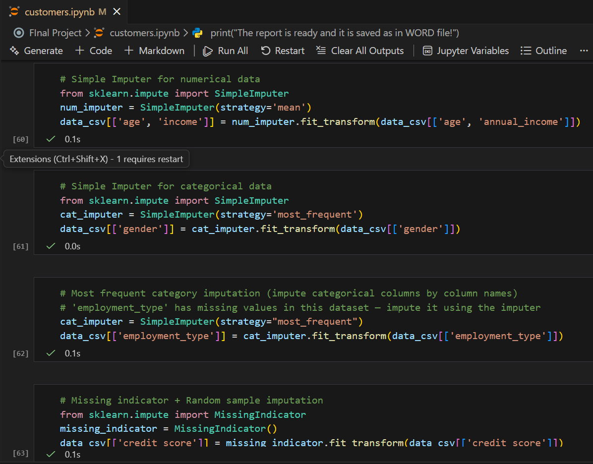

# 📘 **Customer Credit Risk – Data Preprocessing & Feature Engineering Project**

---

## 🏦 **Project Overview**
This project demonstrates **complete data preprocessing** and **feature engineering** for a fintech credit-risk dataset to prepare it for Machine Learning modeling.

---

# 🖼️ **📌 Screenshot 1: Dataset Preview**
➡️ 

---

Data is collected from:
- 📄 **CSV file** (main credit dataset)  
- 🗂️ **JSON metadata file**  
- 📓 **Jupyter Notebook pipeline**  
- 🧹 **Cleaned final dataset**  
- 📑 **Preprocessing Report (DOCX)**  

---

# 📁 **Dataset Sources**
- **credit_dataset.csv** – Raw credit dataset  
- **cleaned_transformed_credit_dataset.csv** – Fully processed ML-ready dataset  
- **customer_metadata.json** – Additional customer info  
- **customers.ipynb** – Notebook containing the full pipeline  
- **Preprocessing_Report.docx** – Final documentation report  

---

# 🧹 **1. Missing Value Treatment**
✔ Median imputation for numerical features (age, annual_income, loan_amount, credit_score)  
✔ Most-frequent imputation for categorical features (gender, employment_type)  
✔ Missing indicator flags added for annual_income & credit_score  
✔ Random Sample Imputation used for income distribution preservation  
✔ KNN Imputer & MICE applied for multivariate numeric imputations  

✨ **Effectiveness:**  
All missing values were handled safely while maintaining realistic distributions.

---

# 🚨 **2. Outlier Handling**
✔ Winsorization (1%–99%) for income, loan amount, credit score  
✔ IQR-based outlier flags created  
✔ Extreme values capped, not removed  

✨ **Effectiveness:**  
Outlier impact reduced without distorting dataset structure.

---

# 🔤 **3. Encoding Techniques**
✔ **Ordinal Encoding** → education_level  
✔ **Label Encoding** → gender  
✔ **One-Hot Encoding** → region, loan_purpose  
✔ **Binning** → repayment history, income quartiles  
✔ **KMeans Clustering** → transaction_count groups  

✨ **Effectiveness:**  
All categorical & numerical attributes converted into ML-compatible formats.

---

# 📏 **4. Scaling & Transformations**
✔ **StandardScaler** → annual_income, loan_amount  
✔ **MinMaxScaler** → normalized income/spending  
✔ **RobustScaler** → spending_ratio  
✔ **Log, Sqrt, Reciprocal Transformations** → reduce skew  
✔ **Box-Cox & Yeo-Johnson** → normalize numerical distributions  

✨ **Why?**  
Creates smoother distributions → better ML model performance & stability.

---

# 🛠️ **5. Feature Engineering**
New predictive features created:

- 💰 **Debt-to-Income Ratio**  
- 📊 **Average Monthly Transactions**  
- 🧮 **Spending-to-Income Ratio**  
- 📅 **Tenure (days, months, years)**  
- 🔐 **Credit Score >700 Flag**  
- 📈 **Loan-to-Income Percentage**  

✨ **Usefulness:**  
These derived features significantly boost model prediction power.

---

# 📊 **6. Final Dataset Readiness**
After processing:

- ✔ Missing values: **0**  
- ✔ All categorical variables encoded  
- ✔ Scaled numerical features  
- ✔ Outliers handled  
- ✔ New features constructed  
- ✔ Fully ML-ready dataset  

📂 **Final Shape:** *(Add shape here after checking dataframe)*  

Perfect for:
- Logistic Regression  
- Random Forest  
- XGBoost  
- SVM  
- ANN models  

---

# 🏁 **Conclusion**
This project successfully demonstrates:
- Full preprocessing  
- Outlier handling  
- Encoding  
- Scaling  
- Transformation  
- Feature engineering  
- ML-ready dataset creation  

You now have a complete pipeline for credit-risk modeling in production-grade systems. 🚀

---